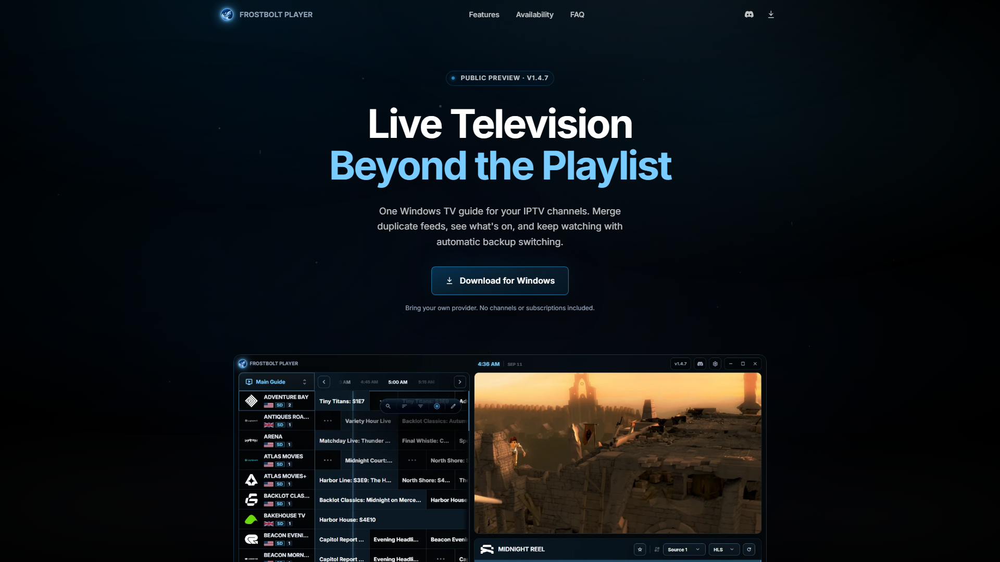
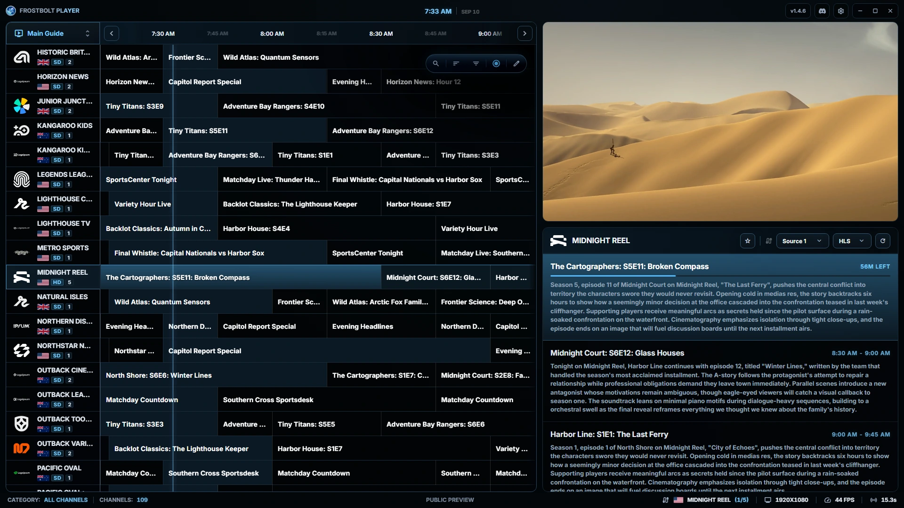
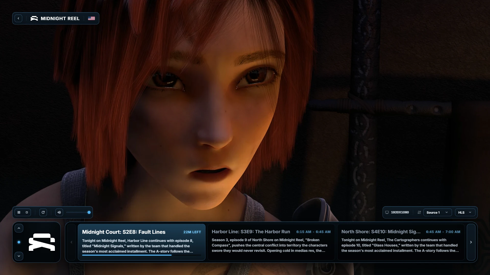

# Frostbolt Player

A desktop IPTV player for Windows. Browse your channels, see what's on, and watch from the TV guide.

**[Download for Windows](https://github.com/mitchivin/frostbolt-player/releases/latest) · [Website](https://frostbolt.xyz/)**

Currently in public preview. Connect your own Xtream-compatible provider to get started.

## Features

- **TV guide.** Browse live TV, 24/7 channels and live events.
- **Multiple sources per channel.** Keep matching feeds together, switch sources, and recover automatically when a feed fails.
- **Playlist management.** Choose what appears in your guide, rename channels, and manage favourites and custom lists.
- **Programme information.** Choose guide data and adjust timings when a schedule is out of sync.
- **Channel health checks.** Scan your list to find working and unavailable feeds.
- **Fullscreen controls.** See now-and-next programmes and switch channels or sources without leaving the video.
- **Two dark themes.** Frostbolt and Regrowth.
- **Save your setup.** Export and restore your library with blueprints.

## Get started

1. Download the Windows **Setup installer** from [Releases](https://github.com/mitchivin/frostbolt-player/releases/latest).
2. Connect your Xtream-compatible provider.
3. Choose your channels in the setup wizard and start watching.

This repository contains public product information and release downloads. The application source is not published here.

## About

Built by [Mitch Ivin](https://mitchivin.com/).

Frostbolt is a media player. It does not supply channels, playlists or subscriptions. Use a provider you are authorised to access.

Screenshots show fictional demo channels in Frostbolt Player 1.4.7. Film stills: *Sintel*, © copyright [Blender Foundation](https://durian.blender.org/), used under [CC BY 3.0](https://creativecommons.org/licenses/by/3.0/).

Overview captured at 1920 × 1080.

